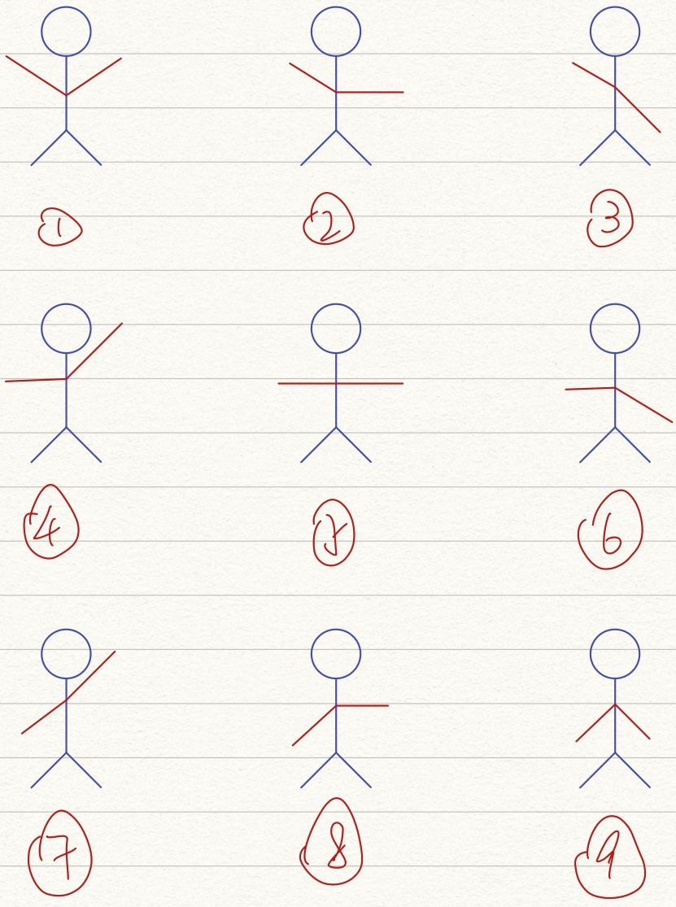

# Pose Estimation

## Pose index


## Different function of Different version 

| Version | Function |
|:---|:---|
|Pose_estim_V2| Single person pose detection|
|Pose_estim_V3| Multiple people pose Estimation(with YOLOv4)|
|Pose_estim_V3_1|Multiple people pose Estimation(with YOLOv4)|

## Ros Topic list

For pose_estim_V3_1.py

|Type|Topic|Data_type|
|:---:|:---:|:---:|
|Subscriber|/camera/color/image_raw|Image|
|Subscriber|/camera/aligned_depth_to_color/image_raw|Image|
|Subscriber|/camera/color/camera_info|CameraInfo|
|Publisher|/detected_human|Image|
|Publisher|/detected_gesture|String|

## Internal testing

```bash 

roslaunch px4 mavros_posix_sitl.launch
roslaunch control_gui control_gui.launch
roslaunch realsense2_camera rs_camera.launch align_depth:=true
python3 pose_estim_V3_1.py

```